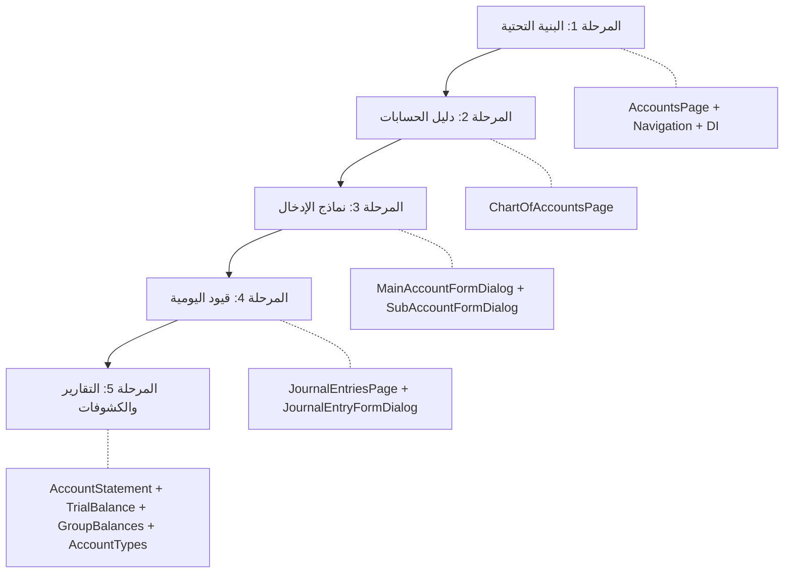

# 🏦 خطة شاملة لشاشات ميزة الحسابات (Accounts Feature - Desktop Screens)

## السياق والتحليل

### البنية الحالية لميزة الحسابات

ميزة الحسابات تتبع **Clean Architecture** وتحتوي على 4 كيانات رئيسية:

| الكيان | الوصف | الحقول الرئيسية |
|--------|-------|-----------------|
| [MainAccountEntity](file:///home/osmsoftwareengineering/flutter_projects/flowcash/lib/features/accounts/domain/entities/main_account_entity.dart) | الحساب الرئيسي (الأب) | `id`, `accountName`, `accountNumber`, `mainAccountType`, `incrementsBalance`, `decrementsBalance`, `currencyId` |
| [SubAccountEntity](file:///home/osmsoftwareengineering/flutter_projects/flowcash/lib/features/accounts/domain/entities/sub_account_entity.dart) | الحساب الفرعي (الابن) | `id`, `mainAccountId`, `accountName`, `accountNumber`, `subAccountType`, `currencyId`, `balanceMax`, `createdAt` |
| [JournalEntryEntity](file:///home/osmsoftwareengineering/flutter_projects/flowcash/lib/features/accounts/domain/entities/journal_entry_entity.dart) | قيد اليومية | `id`, `referenceNumber`, `description`, `createdAt`, `currencyId`, `exPrice`, `baseAmount` |
| [JournalItemEntity](file:///home/osmsoftwareengineering/flutter_projects/flowcash/lib/features/accounts/domain/entities/journal_item_entity.dart) | بند قيد اليومية | `id`, `entryId`, `accountId`, `debit`, `credit`, `currencyId`, `debitBase`, `creditBase` |

### هرمية الحسابات (Account Hierarchy)

```mermaid
graph TD
    A["MainAccountGroup (5 مجموعات)"] --> B["أصول (Assets)"]
    A --> C["إلتزامات (Liabilities)"]
    A --> D["مصروفات (Expenses)"]
    A --> E["ايرادات (Revenues)"]
    A --> F["حقوق ملكية (Property Rights)"]
    
    B --> B1["حسابات مدينة (Debtors)"]
    B --> B2["نقدية (Cashes)"]
    B --> B3["مخزون (Inventory)"]
    B --> B4["أصول ملموسة"]
    B --> B5["أصول غير ملموسة"]
    B --> B6["ايرادات مستحقة"]
    B --> B7["مصروفات مقدمة"]
    
    C --> C1["حسابات دائنة (Creditors)"]
    C --> C2["ايرادات مقدمة"]
    C --> C3["مصروفات مستحقة"]
    
    D --> D1["مصروفات تشغيلية"]
    D --> D2["مصروفات آخرى"]
    D --> D3["مشتريات"]
    D --> D4["مرتجع مبيعات"]
    D --> D5["تكلفة المبيعات"]
    
    E --> E1["ايرادات خدمات"]
    E --> E2["مبيعات"]
    E --> E3["مرتحع مشتريات"]
    
    F --> F1["رأس مال"]
    F --> F2["الأرباح والخسائر"]
```



### الحالة الحالية لطبقة الـ Presentation

- 📂 `presentation/` → **فارغة بالكامل** — لا يوجد أي صفحات أو BLoC أو Widgets
- ✅ طبقات Domain و Data و DataSources → **مكتملة** مع Use Cases جاهزة

---

## الشاشات المقترحة (10 شاشات)

بما أن هذه الشاشات **ديسكتوب** وتظهر في **الجزء الأيسر** من الشاشة (داخل `_HomeBody` عند اختيار `AccountsHomeSection`)، فالتصميم يعتمد على نمط **Master-Detail** مع تبويبات. جميع نماذج إدخال البيانات تظهر كـ **Dialog**.

---

### 📋 الشاشة 1: الصفحة الرئيسية للحسابات (`AccountsPage`)

> **الشاشة الحاوية الرئيسية** التي يتم عرضها عند اختيار "إدارة الحسابات" من القائمة الجانبية.

**المكونات:**
- شريط علوي (`AppBar`) يحتوي على عنوان "إدارة الحسابات" + شريط بحث عام
- شريط تبويبات (`TabBar`) للتبديل بين الأقسام:
  - 🏛️ **دليل الحسابات** (Chart of Accounts) — الافتراضي
  - 📒 **قيود اليومية** (Journal Entries)
  - 🔍 **كشف حساب** (Account Statement)
  - ⚖️ **ميزان المراجعة** (Trial Balance)
  - 📊 **تقرير الأرصدة** (Balances Report)
  - ⚙️ **إدارة أنواع الحسابات** (Account Types Management)

**الملفات:**
```
presentation/
├── pages/
│   └── accounts_page.dart
├── blocs/
│   └── accounts_navigation/
│       ├── accounts_navigation_bloc.dart
│       ├── accounts_navigation_event.dart
│       └── accounts_navigation_state.dart
```

---

### 📋 الشاشة 2: دليل الحسابات (`ChartOfAccountsPage`)

> **عرض شجري/هرمي** لجميع الحسابات الرئيسية والفرعية.

**المكونات:**
- **شريط أدوات** يحتوي على:
  - فلتر حسب المجموعة (`MainAccountGroup`: أصول / إلتزامات / مصروفات / ايرادات / حقوق ملكية)
  - زر إضافة حساب رئيسي جديد
  - زر إعادة تحميل
- **العرض الرئيسي**: جدول (`Table`) قابل للتوسيع (`Expandable`) يعرض:
  - المجموعات الرئيسية (`MainAccountGroup`) كعناوين أقسام
  - الحسابات الرئيسية (`MainAccountEntity`) كصفوف رئيسية يمكن توسيعها
  - الحسابات الفرعية (`SubAccountEntity`) كصفوف فرعية داخل كل حساب رئيسي
- **أعمدة الجدول**: رقم الحساب | اسم الحساب | النوع | الرصيد المدين | الرصيد الدائن | الرصيد الصافي | العملة

**الملفات:**
```
presentation/
├── pages/
│   └── chart_of_accounts/
│       └── chart_of_accounts_page.dart
├── blocs/
│   └── chart_of_accounts/
│       ├── chart_of_accounts_bloc.dart
│       ├── chart_of_accounts_event.dart
│       └── chart_of_accounts_state.dart
├── widgets/
│   ├── account_group_section.dart
│   ├── main_account_row.dart
│   └── sub_account_row.dart
```

**Use Cases المطلوبة:**
- `GetMainAccountsUseCase` — جلب جميع الحسابات الرئيسية
- `GetSubAccountsUseCase` + `whereMainAccountId` — جلب الحسابات الفرعية لكل حساب رئيسي
- `DeleteMainAccountUseCase` / `DeleteSubAccountUseCase`

---

### 📋 الشاشة 3: نموذج الحساب الرئيسي — `Dialog` (`MainAccountFormDialog`)

> **نافذة حوار (Dialog)** لإنشاء أو تعديل حساب رئيسي.

**الحقول:**
- اسم الحساب (`accountName`) — `TextField`
- رقم الحساب (`accountNumber`) — **يُولّد تلقائياً** بناءً على `getMaxAccountNumber`
- مجموعة الحساب (`MainAccountGroup`) — `DropdownButton`
- نوع الحساب (`MainAccountType`) — `DropdownButton` مفلتر حسب المجموعة المختارة
- العملة (`currencyId`) — `DropdownButton`
- صورة الحساب (`imagePath`) — اختياري

**الملفات:**
```
presentation/
├── pages/
│   └── chart_of_accounts/
│       └── main_account_form_dialog.dart
├── blocs/
│   └── main_account_form/
│       ├── main_account_form_bloc.dart
│       ├── main_account_form_event.dart
│       └── main_account_form_state.dart
```

**Use Cases المطلوبة:**
- `InsertMainAccountUseCase` / `UpdateMainAccountUseCase`
- `GetMaxAccountNumberUseCase`

---

### 📋 الشاشة 4: نموذج الحساب الفرعي — `Dialog` (`SubAccountFormDialog`)

> **نافذة حوار (Dialog)** لإنشاء أو تعديل حساب فرعي.

**الحقول:**
- اسم الحساب (`accountName`) — `TextField`
- رقم الحساب (`accountNumber`) — **يُولّد تلقائياً**
- الحساب الرئيسي (`mainAccountId`) — `DropdownButton` (اختيار الحساب الأب)
- نوع الحساب الفرعي (`SubAccountType`) — `DropdownButton` مفلتر حسب نوع الحساب الرئيسي
- العملة (`currencyId`) — `DropdownButton`
- الحد الأقصى للرصيد (`balanceMax`) — `TextField` (اختياري)

**الملفات:**
```
presentation/
├── pages/
│   └── chart_of_accounts/
│       └── sub_account_form_dialog.dart
├── blocs/
│   └── sub_account_form/
│       ├── sub_account_form_bloc.dart
│       ├── sub_account_form_event.dart
│       └── sub_account_form_state.dart
```

**Use Cases المطلوبة:**
- `InsertSubAccountUseCase` / `UpdateSubAccountUseCase`
- `UpdateCounterUseCase` (لتحديث عداد الحساب الرئيسي)

---

### 📋 الشاشة 5: قيود اليومية (`JournalEntriesPage`)

> **عرض جدولي** لجميع قيود اليومية مع إمكانية التصفية والبحث.

**المكونات:**
- **شريط أدوات**: بحث بالرقم المرجعي + فلتر بالتاريخ + زر إضافة قيد جديد
- **جدول القيود**: رقم مرجعي | الوصف | التاريخ | العملة | المبلغ الأساسي | عدد البنود
- **عند النقر على قيد**: عرض تفاصيل القيد (بنود القيد) في لوحة أسفل الجدول

**الملفات:**
```
presentation/
├── pages/
│   └── journal_entries/
│       └── journal_entries_page.dart
├── blocs/
│   └── journal_entries/
│       ├── journal_entries_bloc.dart
│       ├── journal_entries_event.dart
│       └── journal_entries_state.dart
├── widgets/
│   ├── journal_entry_row.dart
│   └── journal_entry_detail_panel.dart
```

**Use Cases المطلوبة:**
- `GetJournalEntriesUseCase`
- `DeleteJournalEntryUseCase`
- `GetJournalItemsByEntryIdUseCase` — لجلب بنود القيد

---

### 📋 الشاشة 6: نموذج قيد اليومية — `Dialog` (`JournalEntryFormDialog`)

> **نافذة حوار (Dialog)** لإنشاء أو تعديل قيد يومية مع بنوده.

**المكونات:**
- **القسم العلوي (رأس القيد)**:
  - الرقم المرجعي (`referenceNumber`) — يُولّد تلقائياً
  - الوصف (`description`) — `TextField`
  - التاريخ (`createdAt`) — `DatePicker`
  - العملة (`currencyId`) + سعر الصرف (`exPrice`)
- **القسم السفلي (بنود القيد)**:
  - جدول ديناميكي قابل للإضافة والحذف
  - أعمدة: الحساب (بحث بالاسم) | مدين | دائن | الوصف
  - شريط ملخص: إجمالي المدين | إجمالي الدائن | الفرق (يجب أن يساوي صفر)

**الملفات:**
```
presentation/
├── pages/
│   └── journal_entries/
│       └── journal_entry_form_dialog.dart
├── blocs/
│   └── journal_entry_form/
│       ├── journal_entry_form_bloc.dart
│       ├── journal_entry_form_event.dart
│       └── journal_entry_form_state.dart
├── widgets/
│   └── journal_item_row_form.dart
```

**Use Cases المطلوبة:**
- `InsertJournalEntryUseCase` / `UpdateJournalEntryUseCase`
- `InsertJournalItemUseCase` / `UpdateJournalItemUseCase` / `DeleteJournalItemUseCase`
- `GetSubAccountsSimple` — للبحث عن الحسابات الفرعية (autocomplete)
- `UpdateSubaccountBalanceUseCase` / `UpdateMainAccountBalanceUseCase` — لتحديث أرصدة الحسابات

---

### 📋 الشاشة 7: كشف حساب (`AccountStatementPage`)

> **تقرير تفصيلي بسيط** يعرض حركة حساب فرعي محدد بفلاتر بسيطة (تاريخ + حساب فقط).

**المكونات:**
- **شريط فلاتر بسيط**:
  - اختيار الحساب (`SubAccountEntity`) — `SearchField` مع autocomplete
  - نطاق التاريخ (من / إلى)
  - زر "عرض الكشف"
- **رأس الكشف**: اسم الحساب | رقم الحساب | النوع | الرصيد الافتتاحي
- **جدول الحركات**: التاريخ | الرقم المرجعي | الوصف | مدين | دائن | الرصيد التراكمي
- **ذيل الكشف**: إجمالي المدين | إجمالي الدائن | الرصيد الختامي

**الملفات:**
```
presentation/
├── pages/
│   └── account_statement/
│       └── account_statement_page.dart
├── blocs/
│   └── account_statement/
│       ├── account_statement_bloc.dart
│       ├── account_statement_event.dart
│       └── account_statement_state.dart
├── widgets/
│   ├── statement_header.dart
│   ├── statement_row.dart
│   └── statement_summary.dart
```

**Use Cases المطلوبة:**
- `GetJournalItemsByAccountIdUseCase` — جلب جميع حركات الحساب
- `GetSubAccountByIdUseCase` — بيانات الحساب
- `GetSubaccountBalanceUseCase` / `GetSubaccountDebtorBalanceUseCase` / `GetSubaccountCreditorBalanceUseCase`

---

### 📋 الشاشة 8: ميزان المراجعة (`TrialBalancePage`)

> **تقرير يعرض جميع الحسابات مع أرصدتها المدينة والدائنة** للتحقق من توازن القيود.

**المكونات:**
- **شريط أدوات**: فلتر بالفترة المحاسبية + زر طباعة/تصدير
- **جدول ميزان المراجعة**:
  - أعمدة: رقم الحساب | اسم الحساب | النوع | رصيد مدين | رصيد دائن
  - صفوف مجمعة حسب `MainAccountGroup` مع مجاميع فرعية لكل مجموعة
- **ذيل الجدول**: إجمالي الأرصدة المدينة | إجمالي الأرصدة الدائنة | حالة التوازن (✅ متوازن / ❌ غير متوازن)

**الملفات:**
```
presentation/
├── pages/
│   └── trial_balance/
│       └── trial_balance_page.dart
├── blocs/
│   └── trial_balance/
│       ├── trial_balance_bloc.dart
│       ├── trial_balance_event.dart
│       └── trial_balance_state.dart
├── widgets/
│   ├── trial_balance_group_row.dart
│   └── trial_balance_total_row.dart
```

**Use Cases المطلوبة:**
- `GetMainAccountsUseCase` — جلب جميع الحسابات الرئيسية مع أرصدتها
- `GetSubAccountsUseCase` — جلب الحسابات الفرعية مع أرصدتها

---

### 📋 الشاشة 9: تقرير الأرصدة حسب المجموعة (`GroupBalancesReportPage`)

> **تقرير تحليلي** يعرض ملخص أرصدة الحسابات مصنفة حسب المجموعات الرئيسية الخمس.

**المكونات:**
- **شريط أدوات**: فلتر بالفترة المحاسبية
- **بطاقات ملخص علوية** (Summary Cards): بطاقة لكل `MainAccountGroup` تعرض:
  - اسم المجموعة | عدد الحسابات | إجمالي الرصيد
- **جدول تفصيلي** عند النقر على بطاقة مجموعة:
  - يعرض الحسابات الرئيسية ضمن تلك المجموعة مع أرصدتها
  - أعمدة: رقم الحساب | اسم الحساب | النوع | الرصيد المدين | الرصيد الدائن | الرصيد الصافي

**الملفات:**
```
presentation/
├── pages/
│   └── group_balances/
│       └── group_balances_report_page.dart
├── blocs/
│   └── group_balances/
│       ├── group_balances_bloc.dart
│       ├── group_balances_event.dart
│       └── group_balances_state.dart
├── widgets/
│   ├── group_balance_card.dart
│   └── group_balance_detail_table.dart
```

**Use Cases المطلوبة:**
- `GetMainAccountsUseCase` — مع تجميع حسب `mainAccountType.accountType`
- `GetSubAccountsUseCase` — لتفصيل الحسابات الفرعية داخل كل مجموعة

---

### 📋 الشاشة 10: إدارة أنواع الحسابات (`AccountTypesManagementPage`)

> **صفحة مرجعية** تعرض جميع أنواع الحسابات المتاحة في النظام وإعداداتها.

**المكونات:**
- **تبويب حسب المجموعة** (`MainAccountGroup`):
  - لكل مجموعة جدول يعرض أنواع الحسابات الرئيسية (`MainAccountType`) المنتمية لها
- **أعمدة الجدول**: رقم النوع | اسم النوع | طبيعة الحساب (مدين/دائن) | نوع الفترة (دائم/مؤقت) | اسم الزيادة | اسم النقصان | افتراضي
- **تفصيل أنواع الحسابات الفرعية**: عند النقر على نوع رئيسي، يعرض أنواع الحسابات الفرعية (`SubAccountType`) المرتبطة به
- **ملاحظة**: هذه الصفحة **للعرض فقط (Read-Only)** — لأن أنواع الحسابات مُعرّفة كـ `sealed class` ثابتة في الكود

**الملفات:**
```
presentation/
├── pages/
│   └── account_types/
│       └── account_types_management_page.dart
├── widgets/
│   ├── main_account_type_table.dart
│   └── sub_account_type_table.dart
```

> [!NOTE]
> هذه الشاشة لا تحتاج BLoC لأنها تعتمد على بيانات ثابتة (`MainAccountType.values` و `SubAccountType.values`).

---

## الهيكل النهائي لمجلد الـ Presentation

```
lib/features/accounts/presentation/
├── pages/
│   ├── accounts_page.dart                          ← الصفحة الحاوية الرئيسية
│   ├── chart_of_accounts/
│   │   ├── chart_of_accounts_page.dart             ← دليل الحسابات
│   │   ├── main_account_form_dialog.dart           ← Dialog حساب رئيسي
│   │   └── sub_account_form_dialog.dart            ← Dialog حساب فرعي
│   ├── journal_entries/
│   │   ├── journal_entries_page.dart               ← قائمة قيود اليومية
│   │   └── journal_entry_form_dialog.dart          ← Dialog قيد يومية
│   ├── account_statement/
│   │   └── account_statement_page.dart             ← كشف حساب
│   ├── trial_balance/
│   │   └── trial_balance_page.dart                 ← ميزان المراجعة
│   ├── group_balances/
│   │   └── group_balances_report_page.dart         ← تقرير الأرصدة
│   └── account_types/
│       └── account_types_management_page.dart      ← إدارة أنواع الحسابات
├── blocs/
│   ├── accounts_navigation/
│   │   ├── accounts_navigation_bloc.dart
│   │   ├── accounts_navigation_event.dart
│   │   └── accounts_navigation_state.dart
│   ├── chart_of_accounts/
│   │   ├── chart_of_accounts_bloc.dart
│   │   ├── chart_of_accounts_event.dart
│   │   └── chart_of_accounts_state.dart
│   ├── main_account_form/
│   │   ├── main_account_form_bloc.dart
│   │   ├── main_account_form_event.dart
│   │   └── main_account_form_state.dart
│   ├── sub_account_form/
│   │   ├── sub_account_form_bloc.dart
│   │   ├── sub_account_form_event.dart
│   │   └── sub_account_form_state.dart
│   ├── journal_entries/
│   │   ├── journal_entries_bloc.dart
│   │   ├── journal_entries_event.dart
│   │   └── journal_entries_state.dart
│   ├── journal_entry_form/
│   │   ├── journal_entry_form_bloc.dart
│   │   ├── journal_entry_form_event.dart
│   │   └── journal_entry_form_state.dart
│   ├── account_statement/
│   │   ├── account_statement_bloc.dart
│   │   ├── account_statement_event.dart
│   │   └── account_statement_state.dart
│   ├── trial_balance/
│   │   ├── trial_balance_bloc.dart
│   │   ├── trial_balance_event.dart
│   │   └── trial_balance_state.dart
│   └── group_balances/
│       ├── group_balances_bloc.dart
│       ├── group_balances_event.dart
│       └── group_balances_state.dart
└── widgets/
    ├── account_group_section.dart
    ├── main_account_row.dart
    ├── sub_account_row.dart
    ├── journal_entry_row.dart
    ├── journal_entry_detail_panel.dart
    ├── journal_item_row_form.dart
    ├── statement_header.dart
    ├── statement_row.dart
    ├── statement_summary.dart
    ├── trial_balance_group_row.dart
    ├── trial_balance_total_row.dart
    ├── group_balance_card.dart
    ├── group_balance_detail_table.dart
    ├── main_account_type_table.dart
    └── sub_account_type_table.dart
```

---

## خطة التنفيذ (ترتيب هرمي تدريجي)



| المرحلة | الشاشة | الأولوية | المتطلبات المسبقة |
|---------|--------|----------|-------------------|
| **1.1** | `AccountsPage` (الحاوية + التنقل) | 🔴 عالية | لا شيء |
| **1.2** | حقن التبعيات (`accounts_injection.dart`) | 🔴 عالية | لا شيء |
| **2.1** | `ChartOfAccountsPage` (دليل الحسابات) | 🔴 عالية | المرحلة 1 |
| **3.1** | `MainAccountFormDialog` (Dialog حساب رئيسي) | 🔴 عالية | المرحلة 2 |
| **3.2** | `SubAccountFormDialog` (Dialog حساب فرعي) | 🔴 عالية | المرحلة 3.1 |
| **4.1** | `JournalEntriesPage` (قيود اليومية) | 🟡 متوسطة | المرحلة 1 |
| **4.2** | `JournalEntryFormDialog` (Dialog قيد يومية) | 🟡 متوسطة | المرحلة 4.1 |
| **5.1** | `AccountStatementPage` (كشف حساب بسيط) | 🟢 عادية | المرحلة 2 + 4 |
| **5.2** | `TrialBalancePage` (ميزان المراجعة) | 🟢 عادية | المرحلة 2 |
| **5.3** | `GroupBalancesReportPage` (تقرير الأرصدة) | 🟢 عادية | المرحلة 2 |
| **5.4** | `AccountTypesManagementPage` (أنواع الحسابات) | 🟢 عادية | لا شيء (بيانات ثابتة) |

---

## تعديلات خارج ميزة الحسابات

### الربط مع الصفحة الرئيسية

#### [MODIFY] [home_page.dart](file:///home/osmsoftwareengineering/flutter_projects/flowcash/lib/features/home/presentation/pages/home_page.dart)
- تبديل `Container()` في حالة `AccountsHomeSection` بـ `AccountsPage()` الجديدة

### حقن التبعيات

#### [NEW] `accounts_injection.dart`
- إنشاء ملف حقن تبعيات خاص بميزة الحسابات يسجل:
  - `MainAccountRepository` + `SubAccountRepository` (غير مسجلة حالياً)
  - جميع Use Cases الخاصة بـ `MainAccount` و `SubAccount`
  - جميع BLoCs المطلوبة

#### [MODIFY] [injection_container.dart](file:///home/osmsoftwareengineering/flutter_projects/flowcash/lib/features/injection_container.dart)
- استدعاء `initAccountsFeature(sl)` الجديدة

---

## Verification Plan

### Automated Tests
- تشغيل `flutter analyze` للتأكد من عدم وجود أخطاء
- التأكد من أن التطبيق يبنى بنجاح على Desktop

### Manual Verification
- التنقل بين التبويبات الـ 6 في شاشة الحسابات
- إضافة / تعديل / حذف حساب رئيسي وفرعي عبر Dialogs
- إنشاء قيد يومية وإضافة بنود عبر Dialog
- عرض كشف حساب لحساب محدد مع فلتر تاريخ بسيط
- التحقق من توازن ميزان المراجعة
- عرض تقرير الأرصدة حسب المجموعة مع البطاقات
- استعراض أنواع الحسابات المرجعية
