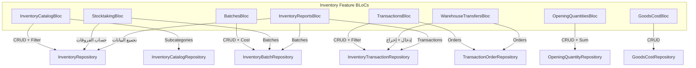

# 📦 خطة شاملة لميزة المخزون (Inventory Feature) — النسخة المحدّثة v2

## التغييرات عن النسخة السابقة

> [!IMPORTANT]
> **تم نقل إدارة المخازن والإعدادات** خارج ميزة المخزون. ستكون ضمن ميزة جديدة مستقلة اسمها **`system`** تشمل:
> - إعداد العملات وأسعار الصرف
> - بيانات المستودعات والمخازن وإعداداتها (`WarehouseEntity` + `WarehouseValueEntity`)

---

## البنية الحالية (ملخص سريع)

| الطبقة | العدد | الحالة |
|--------|-------|--------|
| Domain (Entities + Repos + UseCases) | 9 كيانات، 40+ UseCase | ✅ جاهز |
| Data (DataSources + Repos Impl) | 18 ملف DataSource، 9 تنفيذات | ✅ جاهز |
| Presentation (Pages + BLoCs) | **0** | ❌ يحتاج بناء |

---

## التبويبات النهائية لميزة المخزون (8 تبويبات)

### نظرة عامة

| # | التبويب | الأيقونة | تصميم Desktop | الأولوية |
|---|---------|----------|---------------|----------|
| 1 | قائمة المخزون | `Icons.inventory_2_outlined` | **Master-Detail** | 🔴 P1 |
| 2 | الدفعات | `Icons.all_inbox_outlined` | **Master-Detail** | 🔴 P1 |
| 3 | حركات المخزون | `Icons.swap_horiz_outlined` | **Master-Detail** | 🟠 P2 |
| 4 | نقل بين المخازن | `Icons.local_shipping_outlined` | **Master-Detail** | 🟠 P2 |
| 5 | الأرصدة الافتتاحية | `Icons.playlist_add_check_outlined` | جدول بسيط | 🟡 P3 |
| 6 | تكلفة البضاعة | `Icons.price_check_outlined` | جدول بسيط | 🟡 P3 |
| 7 | جرد المخزون | `Icons.fact_check_outlined` | جدول بسيط | 🟡 P3 |
| 8 | تقارير المخزون | `Icons.assessment_outlined` | تقارير + رسوم بيانية | 🔵 P4 |

---

## تفصيل كل تبويب

### التبويب 1: 📋 قائمة المخزون (Inventory Catalog) — `Master-Detail`

> الغرض: عرض كل الأصناف مع تصنيفاتها الفرعية وأرصدتها وطرق تسعيرها

**البيانات:**
- [InventoryEntity](file:///home/osmsoftwareengineering/flutter_projects/flowcash/lib/features/inventory/domain/entities/inventory_entity.dart) — الصنف الأساسي
- [InventorySubcategoryEntity](file:///home/osmsoftwareengineering/flutter_projects/flowcash/lib/features/inventory/domain/entities/inventory_catalog_entity.dart) — التصنيفات الفرعية
- `InventoryCostType`: FIFO | LIFO | المتوسط | يدوي

**🖥️ شاشة الديسكتوب:**

```
┌─────────── Master (يسار) ──────────────────┬────── Detail (يمين) ──────────┐
│  🔍 بحث... [المخزن ▼] [التسعير ▼] [+ إضافة]│                              │
│ ─────────────────────────────────────────── │  📦 تفاصيل الصنف             │
│  الصنف  │ المخزن │ التسعير │ الكمية │ ⚙️    │                              │
│ ─────────────────────────────────────────── │  الاسم: ────────────          │
│  صنف 1  │ مخزن أ │ FIFO   │  150   │ ✏️🗑️ │  المخزن: ────────────         │
│ ▶صنف 2  │ مخزن ب │ متوسط  │  320   │ ✏️🗑️ │  طريقة التسعير: FIFO         │
│  صنف 3  │ مخزن أ │ LIFO   │   75   │ ✏️🗑️ │  الكمية الحالية: 150          │
│                                             │                              │
│                                             │  💼 الحسابات المرتبطة         │
│                                             │  حساب الإيرادات: #201        │
│                                             │  حساب المصروفات: #501        │
│                                             │  مخزون الوارد: #130          │
│                                             │  مخزون الصادر: #131          │
│                                             │                              │
│                                             │  📂 التصنيفات الفرعية         │
│                                             │  ┌─ تصنيف فرعي 1            │
│                                             │  └─ تصنيف فرعي 2            │
└─────────────────────────────────────────────┴──────────────────────────────┘
```

**الملفات:**
- `inventory_catalog_page.dart` — الصفحة الرئيسية (Master-Detail layout)
- `inventory_item_form_dialog.dart` — نموذج إضافة/تعديل صنف
- `inventory_item_detail_panel.dart` — لوحة التفاصيل (الجزء الأيمن)

---

### التبويب 2: 📦 الدفعات (Batches Management) — `Master-Detail`

> الغرض: إدارة دفعات البضائع لكل صنف مع تتبع الصلاحية والتكلفة

**البيانات:**
- [InventoryBatchEntity](file:///home/osmsoftwareengineering/flutter_projects/flowcash/lib/features/inventory/domain/entities/inventory_batch_entity.dart)
- `BatchSource`: مشتريات | مرتجع مبيعات | واحدات إنتاج
- `BatchStatus`: متوفرة | موقفة

**🖥️ شاشة الديسكتوب:**

```
┌─────────── Master (يسار) ──────────────────────┬──── Detail (يمين) ────────┐
│  🔍 بحث... [الصنف ▼] [الحالة ▼] [+ إضافة دفعة] │                          │
│ ──────────────────────────────────────────────── │  📦 تفاصيل الدفعة        │
│  رقم   │ الصنف │ المصدر   │ الكمية│ الحالة│ ⚙️  │                          │
│ ──────────────────────────────────────────────── │  رقم الدفعة: B-001       │
│  B-001 │ صنف1  │ مشتريات │  100  │  ✅  │ ✏️  │  المصدر: مشتريات         │
│ ▶B-002 │ صنف1  │ مرتجع   │   20  │  ✅  │ ✏️  │  الحالة: متوفرة ✅        │
│  B-003 │ صنف2  │ إنتاج   │   50  │  ⛔  │ ✏️  │                          │
│                                                  │  📊 بيانات الكمية         │
│                                                  │  الكمية: 20 وحدة         │
│                                                  │  تكلفة الوحدة: 23.50     │
│                                                  │  الإجمالي: 470.00        │
│                                                  │                          │
│                                                  │  📅 التواريخ              │
│                                                  │  تاريخ الإدخال: 2026-05  │
│                                                  │  تاريخ الإنتاج: 2026-03  │
│                                                  │  تاريخ الانتهاء: 2027-03 │
│                                                  │                          │
│                                                  │  👤 المورد: مورد #5      │
└──────────────────────────────────────────────────┴──────────────────────────┘
```

**الملفات:**
- `batches_page.dart` — الصفحة الرئيسية
- `batch_form_dialog.dart` — نموذج إضافة/تعديل
- `batch_detail_panel.dart` — لوحة التفاصيل

---

### التبويب 3: 🔄 حركات المخزون (Inventory Transactions) — `Master-Detail`

> الغرض: إدارة أذون الإدخال والإخراج وتكلفة البضاعة مع بنودها

**البيانات:**
- [InventoryTransactionEntity](file:///home/osmsoftwareengineering/flutter_projects/flowcash/lib/features/inventory/domain/entities/inventory_transaction_entity.dart)
- [InventoryTransactionOrderEntity](file:///home/osmsoftwareengineering/flutter_projects/flowcash/lib/features/inventory/domain/entities/inventory_transaction_order_entity.dart) — بنود الحركة
- `InventoryTransactionType`: إذن إدخال | إذن إخراج | تكلفة بضاعة

**🖥️ شاشة الديسكتوب:**

```
┌─────────── Master (يسار) ──────────────────────┬──── Detail (يمين) ────────┐
│  🔍 بحث... [النوع ▼] [المخزن ▼] [+ إذن جديد]   │                          │
│ ──────────────────────────────────────────────── │  📋 تفاصيل الحركة        │
│  رقم │ النوع      │ المخزن │ الشخص │ التاريخ│ ⚙️  │                          │
│ ──────────────────────────────────────────────── │  رقم السند: 002          │
│  001 │ 📥 إدخال  │ مخزن أ│ مورد1 │ 05-20 │ 👁️  │  النوع: 📤 إذن إخراج     │
│ ▶002 │ 📤 إخراج  │ مخزن أ│ عميل1 │ 05-21 │ 👁️  │  المخزن: مخزن أ          │
│  003 │ 💰 تكلفة  │ مخزن ب│ ──── │ 05-22 │ 👁️  │  الشخص: عميل1            │
│                                                  │  التاريخ: 2026-05-21     │
│                                                  │  ملاحظات: نقل داخلي      │
│                                                  │                          │
│                                                  │  📋 البنود (Orders)       │
│                                                  │  ┌───────────────────┐   │
│                                                  │  │ الدفعة │ الكمية   │   │
│                                                  │  │ B-001  │  30      │   │
│                                                  │  │ B-002  │  15      │   │
│                                                  │  └───────────────────┘   │
│                                                  │  [+ إضافة بند]           │
└──────────────────────────────────────────────────┴──────────────────────────┘
```

**الملفات:**
- `transactions_page.dart` — الصفحة الرئيسية
- `transaction_form_dialog.dart` — نموذج إنشاء/تعديل حركة
- `transaction_detail_panel.dart` — التفاصيل + البنود
- `transaction_order_form.dart` — نموذج إضافة بند

---

### التبويب 4: 🚚 نقل بين المخازن (Warehouse Transfers) — `Master-Detail`

> الغرض: عمليات نقل البضائع بين المستودعات المختلفة

**البيانات:**
- يعتمد على `InventoryTransactionEntity` + `InventoryTransactionOrderEntity`
- كل عملية نقل = إذن إخراج من مخزن + إذن إدخال في مخزن آخر

**🖥️ شاشة الديسكتوب:**

```
┌─────────── Master (يسار) ──────────────────────┬──── Detail (يمين) ────────┐
│  🔍 بحث... [من مخزن ▼] [إلى مخزن ▼] [+ نقل]   │                          │
│ ──────────────────────────────────────────────── │  🚚 تفاصيل عملية النقل   │
│  رقم │ من مخزن  │ إلى مخزن │ التاريخ │ الحالة   │                          │
│ ──────────────────────────────────────────────── │  رقم العملية: TR-001     │
│ ▶TR-1│ مخزن أ  │ مخزن ب   │ 05-20  │ مكتمل ✅ │  من: مخزن أ              │
│  TR-2│ مخزن ب  │ مخزن ج   │ 05-22  │ معلق ⏳  │  إلى: مخزن ب             │
│                                                  │  التاريخ: 2026-05-20     │
│                                                  │                          │
│                                                  │  📦 الأصناف المنقولة      │
│                                                  │  ┌─────────────────────┐ │
│                                                  │  │ الصنف  │ الكمية     │ │
│                                                  │  │ صنف 1  │  50        │ │
│                                                  │  │ صنف 3  │  25        │ │
│                                                  │  └─────────────────────┘ │
└──────────────────────────────────────────────────┴──────────────────────────┘
```

> [!NOTE]
> هذا التبويب قد يتطلب إضافة Entity جديد (`WarehouseTransferEntity`) أو يمكن بناؤه فوق الـ `InventoryTransactionEntity` الحالي بربط إذن إخراج بإذن إدخال. سنحدد الأنسب أثناء التنفيذ.

**الملفات:**
- `warehouse_transfers_page.dart`
- `transfer_form_dialog.dart`
- `transfer_detail_panel.dart`

---

### التبويب 5: 📊 الأرصدة الافتتاحية (Opening Quantities) — `جدول بسيط`

> الغرض: تسجيل وإدارة الأرصدة الافتتاحية للأصناف

**البيانات:**
- [OpeningQuantityEntity](file:///home/osmsoftwareengineering/flutter_projects/flowcash/lib/features/inventory/domain/entities/opening_quantity_entity.dart)

**🖥️ شاشة الديسكتوب:**

```
┌────────────────────────────────────────────────────────────────────────────┐
│  🔍 بحث...  | [المخزن ▼] [الفترة ▼]                    [+ رصيد جديد] [🔄]│
├────────────────────────────────────────────────────────────────────────────┤
│  التصنيف  │  المخزن   │  الكمية  │  إجمالي التكلفة  │  الفترة  │ الإجراءات│
├────────────────────────────────────────────────────────────────────────────┤
│  صنف 1   │  مخزن أ   │   200    │     5,000.00     │  2026 Q1 │  ✏️ 🗑️  │
│  صنف 2   │  مخزن أ   │    50    │     1,250.00     │  2026 Q1 │  ✏️ 🗑️  │
│  صنف 1   │  مخزن ب   │   100    │     2,500.00     │  2026 Q1 │  ✏️ 🗑️  │
├────────────────────────────────────────────────────────────────────────────┤
│                                   الإجمالي: 8,750.00                      │
└────────────────────────────────────────────────────────────────────────────┘
```

**الملفات:**
- `opening_quantities_page.dart`
- `opening_quantity_form_dialog.dart`

---

### التبويب 6: 💰 تكلفة البضاعة (Goods Cost) — `جدول بسيط`

> الغرض: تتبع وعرض تكاليف البضاعة المباعة وربطها بالقيود المحاسبية

**البيانات:**
- [GoodsCostEntity](file:///home/osmsoftwareengineering/flutter_projects/flowcash/lib/features/inventory/domain/entities/goods_cost_entity.dart)

**🖥️ شاشة الديسكتوب:**

```
┌────────────────────────────────────────────────────────────────────────────┐
│  🔍 بحث...  | [المخزن ▼] [التاريخ من ── إلى ──]                     [🔄] │
├────────────────────────────────────────────────────────────────────────────┤
│  رقم السند │  المخزن  │  المبلغ    │  العملة │  التاريخ   │  القيد  │ ⚙️  │
├────────────────────────────────────────────────────────────────────────────┤
│  GC-001    │  مخزن أ  │  15,000   │  SAR    │  2026-05-20│   #45   │ 👁️  │
│  GC-002    │  مخزن ب  │   8,500   │  SAR    │  2026-05-21│   #47   │ 👁️  │
│  GC-003    │  مخزن أ  │   3,200   │  SAR    │  2026-05-25│   #52   │ 👁️  │
├────────────────────────────────────────────────────────────────────────────┤
│                                   الإجمالي: 26,700.00 SAR                 │
└────────────────────────────────────────────────────────────────────────────┘
```

**الملفات:**
- `goods_cost_page.dart`
- `goods_cost_detail_dialog.dart`

---

### التبويب 7: 📋 جرد المخزون (Stocktaking) — `جدول بسيط`

> الغرض: إجراء عمليات الجرد الدوري ومقارنة الكميات الفعلية بالنظرية

**البيانات:**
- يعتمد على بيانات `InventoryEntity` + `InventoryBatchEntity` + `OpeningQuantityEntity`
- يحسب الفروقات بين الكمية الدفترية والكمية الفعلية

> [!NOTE]
> هذا التبويب قد يتطلب إضافة Entity جديد (`StocktakingEntity` / `StocktakingSessionEntity`) لتخزين جلسات الجرد ونتائجها. أو يمكن بناؤه كتقرير محسوب بدون Entity مستقل في المرحلة الأولى.

**🖥️ شاشة الديسكتوب:**

```
┌────────────────────────────────────────────────────────────────────────────┐
│  [المخزن ▼] [التاريخ: ────]                         [+ جرد جديد] [🔄]    │
├────────────────────────────────────────────────────────────────────────────┤
│  الصنف  │ الكمية الدفترية│ الكمية الفعلية│  الفرق  │  الحالة   │ الإجراءات│
├────────────────────────────────────────────────────────────────────────────┤
│  صنف 1  │      150       │     148      │   -2    │  ⚠️ عجز  │  ✏️      │
│  صنف 2  │      320       │     320      │    0    │  ✅ مطابق │  ──      │
│  صنف 3  │       75       │      80      │   +5    │  📈 فائض  │  ✏️      │
├────────────────────────────────────────────────────────────────────────────┤
│  📊 ملخص الجرد: 3 أصناف | 1 مطابق | 1 عجز | 1 فائض                      │
└────────────────────────────────────────────────────────────────────────────┘
```

**الملفات:**
- `stocktaking_page.dart`
- `stocktaking_session_dialog.dart`

---

### التبويب 8: 📈 تقارير المخزون (Inventory Reports) — `تقارير ورسوم بيانية`

> الغرض: عرض تقارير تحليلية شاملة عن المخزون

**🖥️ شاشة الديسكتوب:**

```
┌────────────────────────────────────────────────────────────────────────────┐
│  [نوع التقرير ▼]  [المخزن ▼]  [من ── إلى ──]              [📥 تصدير]    │
├────────────────────────────────────────────────────────────────────────────┤
│                                                                            │
│  📊 ملخص المخزون                    📈 حركة المخزون عبر الزمن             │
│  ┌──────────────────────┐          ┌──────────────────────────┐           │
│  │  إجمالي الأصناف: 45  │          │   ╱╲    ╱╲               │           │
│  │  إجمالي الكمية: 5,230│          │  ╱  ╲  ╱  ╲  ╱╲          │           │
│  │  إجمالي القيمة: 125K │          │ ╱    ╲╱    ╲╱  ╲         │           │
│  └──────────────────────┘          └──────────────────────────┘           │
│                                                                            │
│  📋 تفصيل حسب المخزن                                                      │
│  ┌─────────────────────────────────────────────────────────────┐          │
│  │  المخزن  │  عدد الأصناف │  الكمية  │  القيمة  │  % من الإجمالي│          │
│  │  مخزن أ  │     25       │  3,200   │  80,000  │    64%       │          │
│  │  مخزن ب  │     20       │  2,030   │  45,000  │    36%       │          │
│  └─────────────────────────────────────────────────────────────┘          │
│                                                                            │
│  ⚠️ تنبيهات                                                               │
│  • 3 أصناف وصلت للحد الأدنى                                               │
│  • 2 دفعات قاربت على انتهاء الصلاحية                                      │
└────────────────────────────────────────────────────────────────────────────┘
```

**أنواع التقارير المتاحة:**
1. **ملخص المخزون** — نظرة عامة على كل المخازن
2. **حركة المخزون** — الوارد والصادر خلال فترة
3. **تقرير الدفعات** — الصلاحيات والتكاليف
4. **تقرير التكلفة** — تكلفة البضاعة المباعة
5. **تقرير المقارنة** — مقارنة بين فترات

**الملفات:**
- `inventory_reports_page.dart`
- `report_summary_card.dart`
- `report_chart_widget.dart`

---

## ترتيب أولوية التنفيذ


---

## هيكل الملفات النهائي

```
lib/features/inventory/presentation/
├── pages/
│   ├── inventory_page.dart                          # الصفحة الرئيسية + TabBar (8 tabs)
│   └── tabs/
│       ├── inventory_catalog/                       # التبويب 1 — Master-Detail
│       │   ├── inventory_catalog_page.dart
│       │   ├── inventory_item_form_dialog.dart
│       │   └── inventory_item_detail_panel.dart
│       ├── batches/                                 # التبويب 2 — Master-Detail
│       │   ├── batches_page.dart
│       │   ├── batch_form_dialog.dart
│       │   └── batch_detail_panel.dart
│       ├── transactions/                            # التبويب 3 — Master-Detail
│       │   ├── transactions_page.dart
│       │   ├── transaction_form_dialog.dart
│       │   ├── transaction_detail_panel.dart
│       │   └── transaction_order_form.dart
│       ├── warehouse_transfers/                     # التبويب 4 — Master-Detail
│       │   ├── warehouse_transfers_page.dart
│       │   ├── transfer_form_dialog.dart
│       │   └── transfer_detail_panel.dart
│       ├── opening_quantities/                      # التبويب 5 — جدول بسيط
│       │   ├── opening_quantities_page.dart
│       │   └── opening_quantity_form_dialog.dart
│       ├── goods_cost/                              # التبويب 6 — جدول بسيط
│       │   ├── goods_cost_page.dart
│       │   └── goods_cost_detail_dialog.dart
│       ├── stocktaking/                             # التبويب 7 — جدول بسيط
│       │   ├── stocktaking_page.dart
│       │   └── stocktaking_session_dialog.dart
│       └── inventory_reports/                       # التبويب 8 — تقارير
│           ├── inventory_reports_page.dart
│           ├── report_summary_card.dart
│           └── report_chart_widget.dart
├── blocs/
│   ├── inventory_catalog/
│   │   ├── inventory_catalog_bloc.dart
│   │   ├── inventory_catalog_event.dart
│   │   └── inventory_catalog_state.dart
│   ├── batches/
│   │   ├── batches_bloc.dart
│   │   ├── batches_event.dart
│   │   └── batches_state.dart
│   ├── transactions/
│   │   ├── transactions_bloc.dart
│   │   ├── transactions_event.dart
│   │   └── transactions_state.dart
│   ├── warehouse_transfers/
│   │   ├── warehouse_transfers_bloc.dart
│   │   ├── warehouse_transfers_event.dart
│   │   └── warehouse_transfers_state.dart
│   ├── opening_quantities/
│   │   ├── opening_quantities_bloc.dart
│   │   ├── opening_quantities_event.dart
│   │   └── opening_quantities_state.dart
│   ├── goods_cost/
│   │   ├── goods_cost_bloc.dart
│   │   ├── goods_cost_event.dart
│   │   └── goods_cost_state.dart
│   ├── stocktaking/
│   │   ├── stocktaking_bloc.dart
│   │   ├── stocktaking_event.dart
│   │   └── stocktaking_state.dart
│   └── inventory_reports/
│       ├── inventory_reports_bloc.dart
│       ├── inventory_reports_event.dart
│       └── inventory_reports_state.dart
└── widgets/
    ├── inventory_item_row.dart
    ├── batch_row.dart
    ├── transaction_row.dart
    ├── transfer_row.dart
    └── opening_quantity_row.dart
```

---

## خريطة الـ BLoCs



---

## ملاحظة حول ميزة System المستقبلية

> [!WARNING]
> ميزة **`system`** ستكون ميزة مستقلة خارج نطاق هذه الخطة، وستشمل:
> - 💱 إعداد العملات وأسعار الصرف
> - 🏢 بيانات المستودعات والمخازن (`WarehouseEntity` + `WarehouseValueEntity`)
> - ⚙️ إعدادات النظام العامة
>
> ستحتاج لخطة منفصلة عند البدء بتنفيذها.

---

## أسئلة مفتوحة

> [!IMPORTANT]
> **1. نقل بين المخازن:** هل تفضل إنشاء `WarehouseTransferEntity` جديد، أم بناء عمليات النقل فوق `InventoryTransactionEntity` الحالي (ربط إذن إخراج بإذن إدخال)؟

> [!IMPORTANT]
> **2. جرد المخزون:** هل تريد تخزين جلسات الجرد في قاعدة البيانات (يتطلب Entity جديد)، أم يكفي أن يكون تقريراً محسوباً في المرحلة الأولى؟

> [!IMPORTANT]
> **3. هل الخطة الحالية تغطي كل ما تحتاجه؟** أم هناك تعديلات إضافية قبل البدء بالتنفيذ؟
