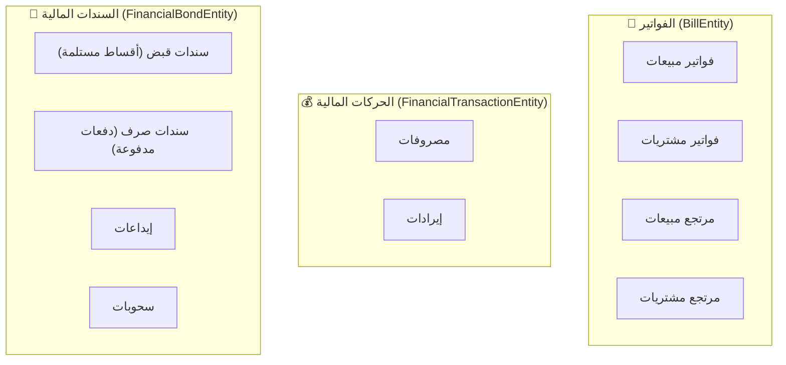

# 📊 خطة شاملة لميزة المعاملات المالية (Transactions Feature)

## تحليل الوضع الحالي

ميزة المعاملات تحتوي على **طبقتي Data و Domain** مكتملتين تماماً، لكن **طبقة Presentation فارغة** بالكامل.

### الكيانات الموجودة (4 Entities)

| الكيان | الوصف | الحقول الرئيسية |
|--------|-------|-----------------|
| [BillEntity](file:///home/osmsoftwareengineering/flutter_projects/flowcash/lib/features/transactions/domain/entities/bill_entity.dart) | الفاتورة (بيع/شراء/مرتجعات) | `billNumber`, `warehouseId`, `personId`, `isCash`, `orders[]` |
| [BillOrderEntity](file:///home/osmsoftwareengineering/flutter_projects/flowcash/lib/features/transactions/domain/entities/bill_order_entity.dart) | بند الفاتورة | `billId`, `categoryId`, `countUnits`, `totalPrice` |
| [FinancialTransactionEntity](file:///home/osmsoftwareengineering/flutter_projects/flowcash/lib/features/transactions/domain/entities/financial_transaction_entity.dart) | الحركة المالية (مصروفات/إيرادات) | `billNumber`, `hintId`, `historyGroup`, `offerAmount` |
| [FinancialBondEntity](file:///home/osmsoftwareengineering/flutter_projects/flowcash/lib/features/transactions/domain/entities/financial_bond_entity.dart) | السند المالي (قبض/صرف/إيداع/سحب) | `billNumber`, `hintId`, `historyGroup`, `offerAmount` |

### أنواع العمليات المالية (من [HistoriesGroup](file:///home/osmsoftwareengineering/flutter_projects/flowcash/lib/core/enums/histories_group_enum.dart))



---

## الصفحات المقترحة

> [!IMPORTANT]
> النمط التصميمي مستلهم من [InventoryPage](file:///home/osmsoftwareengineering/flutter_projects/flowcash/lib/features/inventory/presentation/pages/inventory_page.dart) الذي يستخدم `TabBar` + `TabBarView` مع صفحة رئيسية تضم 8 تبويبات.

### الصفحة الرئيسية: `TransactionsPage`

صفحة حاوية بنظام **TabBar** مع **7 تبويبات**:

```
┌──────────────────────────────────────────────────────────────────────────────────────────────┐
│  💼 إدارة المعاملات المالية                                                                 │
├──────────┬──────────┬───────────┬──────────┬──────────┬──────────┬──────────────────────────────┤
│ فواتير   │ فواتير   │ مرتجعات  │ مصروفات  │ إيرادات  │ سندات   │ التقارير                     │
│ المبيعات │ المشتريات│          │ وإيرادات │          │ المالية │ المالية                      │
└──────────┴──────────┴───────────┴──────────┴──────────┴──────────┴──────────────────────────────┘
```

---

### 📋 التبويب 1: فواتير المبيعات (Sales Bills)

**الهدف**: إدارة فواتير البيع وبنودها.

#### تخطيط الديسكتوب (Master-Detail):

```
┌─────────────────────────────────────────────┬──────────────────────────────────────┐
│           📋 القائمة الرئيسية (60%)          │         📄 تفاصيل الفاتورة (40%)    │
│                                             │                                      │
│  🔍 [بحث برقم الفاتورة/اسم العميل]         │  ┌──────────────────────────────────┐ │
│  📋 [فلتر: حالة الدفع] [فلتر: المستودع]    │  │  فاتورة بيع رقم #00023           │ │
│  ➕ [إنشاء فاتورة بيع جديدة]               │  │  التاريخ: 2026-06-01              │ │
│                                             │  │  العميل: أحمد محمد                │ │
│  ┌─────────────────────────────────────────┐ │  │  المستودع: المستودع الرئيسي       │ │
│  │ # │ رقم الفاتورة │ العميل │ المبلغ │ التاريخ│  │  نوع الدفع: نقدي ✅               │ │
│  ├───┼──────────────┼────────┼────────┼───────│  │  الخصم: 500 ر.ي                  │ │
│  │ ▶ │ #00023       │ أحمد   │ 15,000 │ 06-01 │  │                                  │ │
│  │   │ #00022       │ خالد   │ 8,500  │ 05-28 │  │  ── بنود الفاتورة ──              │ │
│  │   │ #00021       │ محمد   │ 22,000 │ 05-25 │  │  صنف  │ الكمية │ السعر │ الإجمالي│ │
│  │   │ #00020       │ سالم   │ 4,200  │ 05-20 │  │  ──────┼────────┼───────┼─────────│ │
│  └─────────────────────────────────────────┘ │  │  حديد  │ 10     │ 1,000 │ 10,000  │ │
│                                             │  │  إسمنت │ 20     │ 250   │ 5,000   │ │
│                                             │  │                                  │ │
│                                             │  │  الإجمالي: 15,000 ر.ي            │ │
│                                             │  │  بعد الخصم: 14,500 ر.ي           │ │
│                                             │  │                                  │ │
│                                             │  │  [✏️ تعديل] [🗑️ حذف] [🖨️ طباعة] │ │
│                                             │  └──────────────────────────────────┘ │
└─────────────────────────────────────────────┴──────────────────────────────────────┘
```

**الملفات المطلوبة:**
- `presentation/pages/tabs/sales_bills/sales_bills_page.dart` — القائمة الرئيسية
- `presentation/pages/tabs/sales_bills/sales_bill_detail_panel.dart` — لوحة التفاصيل
- `presentation/pages/tabs/sales_bills/sales_bill_form_dialog.dart` — نموذج إنشاء/تعديل فاتورة
- `presentation/pages/tabs/sales_bills/bill_order_form.dart` — نموذج بند الفاتورة
- `presentation/blocs/sales_bills/sales_bills_bloc.dart`
- `presentation/blocs/sales_bills/sales_bills_event.dart`
- `presentation/blocs/sales_bills/sales_bills_state.dart`

---

### 📋 التبويب 2: فواتير المشتريات (Purchase Bills)

**الهدف**: إدارة فواتير الشراء وبنودها.

#### تخطيط الديسكتوب (Master-Detail):

```
┌─────────────────────────────────────────────┬──────────────────────────────────────┐
│           📋 القائمة الرئيسية (60%)          │       📄 تفاصيل فاتورة الشراء (40%) │
│                                             │                                      │
│  🔍 [بحث برقم الفاتورة/اسم المورد]         │  ┌──────────────────────────────────┐ │
│  📋 [فلتر: حالة الدفع] [فلتر: المستودع]    │  │  فاتورة شراء رقم #00015          │ │
│  ➕ [إنشاء فاتورة شراء جديدة]              │  │  المورد: شركة التوريدات          │ │
│                                             │  │  المستودع: المخزن الفرعي          │ │
│  ┌─────────────────────────────────────────┐ │  │  نوع الدفع: آجل ⏳                │ │
│  │ رقم │ المورد │ المبلغ │ التاريخ │ الحالة │  │                                  │ │
│  ├──────┼────────┼────────┼────────┼───────│  │  ── بنود الفاتورة ──              │ │
│  │ ▶#15 │ شركة.. │ 45,000 │ 06-01  │ آجل   │  │  صنف  │ الكمية │ السعر │ الإجمالي│ │
│  │ #14  │ مؤسسة..│ 12,000 │ 05-30  │ نقدي  │  │  ──────┼────────┼───────┼─────────│ │
│  └─────────────────────────────────────────┘ │  │  أسلاك │ 100   │ 200   │ 20,000  │ │
│                                             │  │  مفاتيح│ 50    │ 500   │ 25,000  │ │
│                                             │  │                                  │ │
│                                             │  │  الإجمالي: 45,000 ر.ي            │ │
│                                             │  │  [✏️ تعديل] [🗑️ حذف] [🖨️ طباعة] │ │
│                                             │  └──────────────────────────────────┘ │
└─────────────────────────────────────────────┴──────────────────────────────────────┘
```

**الملفات المطلوبة:**
- `presentation/pages/tabs/purchase_bills/purchase_bills_page.dart`
- `presentation/pages/tabs/purchase_bills/purchase_bill_detail_panel.dart`
- `presentation/pages/tabs/purchase_bills/purchase_bill_form_dialog.dart`
- `presentation/pages/tabs/purchase_bills/bill_order_form.dart` (مشترك مع المبيعات)
- `presentation/blocs/purchase_bills/purchase_bills_bloc.dart`
- `presentation/blocs/purchase_bills/purchase_bills_event.dart`
- `presentation/blocs/purchase_bills/purchase_bills_state.dart`

---

### 📋 التبويب 3: المرتجعات (Returns)

**الهدف**: إدارة مرتجعات المبيعات ومرتجعات المشتريات في مكان واحد.

#### تخطيط الديسكتوب (Master-Detail):

```
┌─────────────────────────────────────────────┬──────────────────────────────────────┐
│           📋 قائمة المرتجعات (60%)           │         📄 تفاصيل المرتجع (40%)     │
│                                             │                                      │
│  🔍 [بحث برقم المرتجع]                     │  ┌──────────────────────────────────┐ │
│  📋 [فلتر: نوع المرتجع ▼]                  │  │  مرتجع مبيعات رقم #00005        │ │
│      ├─ مرتجع مبيعات                        │  │  العميل: أحمد محمد               │ │
│      └─ مرتجع مشتريات                       │  │  فاتورة البيع الأصلية: #00023    │ │
│  ➕ [إنشاء مرتجع جديد]                     │  │                                  │ │
│                                             │  │  ── بنود المرتجع ──               │ │
│  ┌─────────────────────────────────────────┐ │  │  صنف  │ الكمية │ السعر │ المبلغ  │ │
│  │ رقم │ النوع    │ المبلغ │ التاريخ       │  │  ──────┼────────┼───────┼─────────│ │
│  ├──────┼──────────┼────────┼──────────────│  │  حديد  │ 2      │ 1,000 │ 2,000   │ │
│  │ ▶#5  │ مرتجع بيع│ 2,000 │ 06-02        │  │                                  │ │
│  │ #4   │ مرتجع شراء│ 5,500│ 06-01        │  │  إجمالي المرتجع: 2,000 ر.ي       │ │
│  └─────────────────────────────────────────┘ │  │  [✏️ تعديل] [🗑️ حذف]            │ │
│                                             │  └──────────────────────────────────┘ │
└─────────────────────────────────────────────┴──────────────────────────────────────┘
```

**الملفات المطلوبة:**
- `presentation/pages/tabs/returns/returns_page.dart`
- `presentation/pages/tabs/returns/return_detail_panel.dart`
- `presentation/pages/tabs/returns/return_form_dialog.dart`
- `presentation/blocs/returns/returns_bloc.dart`
- `presentation/blocs/returns/returns_event.dart`
- `presentation/blocs/returns/returns_state.dart`

---

### 📋 التبويب 4: المصروفات والإيرادات (Expenses & Revenues)

**الهدف**: إدارة قيود المصروفات والإيرادات (تستخدم `FinancialTransactionEntity`).

#### تخطيط الديسكتوب (Master-Detail):

```
┌─────────────────────────────────────────────┬──────────────────────────────────────┐
│       📋 المصروفات والإيرادات (60%)          │       📄 تفاصيل الحركة (40%)         │
│                                             │                                      │
│  🔍 [بحث برقم السند/البيان]                 │  ┌──────────────────────────────────┐ │
│  📋 [فلتر: النوع ▼]                        │  │  مصروف رقم #00042               │ │
│      ├─ مصروفات                              │  │  التاريخ: 2026-06-01             │ │
│      └─ إيرادات                              │  │  المبلغ: 3,500 ر.ي              │ │
│  ➕ [تسجيل حركة مالية]                      │  │  العملة: ريال يمني               │ │
│                                             │  │  المستودع/الفرع: الرئيسي         │ │
│  ┌─────────────────────────────────────────┐ │  │  البيان: إيجار المعرض            │ │
│  │ رقم │ النوع   │ المبلغ │ البيان │ التاريخ│  │                                  │ │
│  ├──────┼─────────┼────────┼────────┼───────│  │  🔗 القيد المحاسبي: #JE-0089     │ │
│  │ ▶#42 │ مصروف  │ 3,500  │ إيجار  │ 06-01 │  │                                  │ │
│  │ #41  │ إيراد  │ 1,200  │ خدمات  │ 05-30 │  │  [✏️ تعديل] [🗑️ حذف] [🖨️ طباعة] │ │
│  │ #40  │ مصروف  │ 800    │ كهرباء │ 05-28 │  │                                  │ │
│  └─────────────────────────────────────────┘ │  └──────────────────────────────────┘ │
└─────────────────────────────────────────────┴──────────────────────────────────────┘
```

**الملفات المطلوبة:**
- `presentation/pages/tabs/expenses_revenues/expenses_revenues_page.dart`
- `presentation/pages/tabs/expenses_revenues/expense_revenue_detail_panel.dart`
- `presentation/pages/tabs/expenses_revenues/expense_revenue_form_dialog.dart`
- `presentation/blocs/expenses_revenues/expenses_revenues_bloc.dart`
- `presentation/blocs/expenses_revenues/expenses_revenues_event.dart`
- `presentation/blocs/expenses_revenues/expenses_revenues_state.dart`

---

### 📋 التبويب 5: سندات القبض والصرف (Receipts & Payments)

**الهدف**: إدارة سندات القبض (أقساط مستلمة) وسندات الصرف (دفعات مدفوعة) - تستخدم `FinancialBondEntity`.

#### تخطيط الديسكتوب (Master-Detail):

```
┌─────────────────────────────────────────────┬──────────────────────────────────────┐
│       📋 سندات القبض والصرف (60%)            │       📄 تفاصيل السند (40%)          │
│                                             │                                      │
│  🔍 [بحث برقم السند]                        │  ┌──────────────────────────────────┐ │
│  📋 [فلتر: النوع ▼]                        │  │  سند قبض رقم #00018             │ │
│      ├─ سند قبض (أقساط مستلمة)               │  │  التاريخ: 2026-06-01             │ │
│      └─ سند صرف (دفعات مدفوعة)               │  │  المبلغ: 10,000 ر.ي             │ │
│  ➕ [إصدار سند جديد]                        │  │  العملة: ريال يمني               │ │
│                                             │  │  البيان: دفعة من العميل أحمد     │ │
│  ┌─────────────────────────────────────────┐ │  │                                  │ │
│  │ رقم │ النوع   │ المبلغ │ البيان │ التاريخ│  │  🔗 القيد المحاسبي: #JE-0095     │ │
│  ├──────┼─────────┼────────┼────────┼───────│  │                                  │ │
│  │ ▶#18 │ قبض    │ 10,000 │ دفعة.. │ 06-01 │  │  [✏️ تعديل] [🗑️ حذف] [🖨️ طباعة] │ │
│  │ #17  │ صرف    │ 5,000  │ سداد.. │ 05-29 │  │                                  │ │
│  └─────────────────────────────────────────┘ │  └──────────────────────────────────┘ │
└─────────────────────────────────────────────┴──────────────────────────────────────┘
```

**الملفات المطلوبة:**
- `presentation/pages/tabs/receipts_payments/receipts_payments_page.dart`
- `presentation/pages/tabs/receipts_payments/receipt_payment_detail_panel.dart`
- `presentation/pages/tabs/receipts_payments/receipt_payment_form_dialog.dart`
- `presentation/blocs/receipts_payments/receipts_payments_bloc.dart`
- `presentation/blocs/receipts_payments/receipts_payments_event.dart`
- `presentation/blocs/receipts_payments/receipts_payments_state.dart`

---

### 📋 التبويب 6: الإيداعات والسحوبات (Deposits & Withdrawals)

**الهدف**: إدارة حركات الإيداع والسحب البنكية - تستخدم `FinancialBondEntity`.

#### تخطيط الديسكتوب (Master-Detail):

```
┌─────────────────────────────────────────────┬──────────────────────────────────────┐
│       📋 الإيداعات والسحوبات (60%)           │       📄 تفاصيل الحركة (40%)         │
│                                             │                                      │
│  🔍 [بحث برقم السند]                        │  ┌──────────────────────────────────┐ │
│  📋 [فلتر: النوع ▼]                        │  │  سند إيداع رقم #00008            │ │
│      ├─ إيداع                                │  │  التاريخ: 2026-06-01             │ │
│      └─ سحب                                  │  │  المبلغ: 50,000 ر.ي             │ │
│  ➕ [تسجيل حركة جديدة]                      │  │  العملة: ريال يمني               │ │
│                                             │  │  البيان: إيداع في الحساب البنكي  │ │
│  ┌─────────────────────────────────────────┐ │  │                                  │ │
│  │ رقم │ النوع  │ المبلغ  │ البيان │ التاريخ│  │  🔗 القيد المحاسبي: #JE-0098     │ │
│  ├──────┼────────┼─────────┼────────┼───────│  │                                  │ │
│  │ ▶#8  │ إيداع │ 50,000  │ إيداع..│ 06-01 │  │  [✏️ تعديل] [🗑️ حذف] [🖨️ طباعة] │ │
│  │ #7   │ سحب   │ 15,000  │ سحب..  │ 05-28 │  │                                  │ │
│  └─────────────────────────────────────────┘ │  └──────────────────────────────────┘ │
└─────────────────────────────────────────────┴──────────────────────────────────────┘
```

**الملفات المطلوبة:**
- `presentation/pages/tabs/deposits_withdrawals/deposits_withdrawals_page.dart`
- `presentation/pages/tabs/deposits_withdrawals/deposit_withdrawal_detail_panel.dart`
- `presentation/pages/tabs/deposits_withdrawals/deposit_withdrawal_form_dialog.dart`
- `presentation/blocs/deposits_withdrawals/deposits_withdrawals_bloc.dart`
- `presentation/blocs/deposits_withdrawals/deposits_withdrawals_event.dart`
- `presentation/blocs/deposits_withdrawals/deposits_withdrawals_state.dart`

---

### 📋 التبويب 7: التقارير المالية (Financial Reports)

**الهدف**: عرض ملخصات وتقارير لجميع الحركات المالية.

#### تخطيط الديسكتوب:

```
┌────────────────────────────────────────────────────────────────────────────────────┐
│                           📊 التقارير المالية                                      │
│                                                                                    │
│  📅 [من تاريخ: ___]  [إلى تاريخ: ___]  [فلتر: العملة ▼]  [🔄 تحديث]             │
│                                                                                    │
│  ┌──────────────────────┐ ┌──────────────────────┐ ┌──────────────────────┐        │
│  │  💰 إجمالي المبيعات  │ │  🛒 إجمالي المشتريات│ │  📈 صافي الربح       │        │
│  │      150,000 ر.ي     │ │      95,000 ر.ي      │ │      55,000 ر.ي     │        │
│  └──────────────────────┘ └──────────────────────┘ └──────────────────────┘        │
│                                                                                    │
│  ┌──────────────────────┐ ┌──────────────────────┐ ┌──────────────────────┐        │
│  │  📤 إجمالي القبض     │ │  📥 إجمالي الصرف     │ │  💸 المصروفات        │        │
│  │      80,000 ر.ي      │ │      35,000 ر.ي      │ │      12,000 ر.ي     │        │
│  └──────────────────────┘ └──────────────────────┘ └──────────────────────┘        │
│                                                                                    │
│  ┌──────────────────────────────────────────────────────────────────────────┐      │
│  │                    📊 رسم بياني: الحركات المالية عبر الزمن               │      │
│  │   ████                                                                   │      │
│  │   ████  ███                                                              │      │
│  │   ████  ███  ████                                                        │      │
│  │   ____  ____  ____  ____                                                 │      │
│  │   أسبوع1  أسبوع2  أسبوع3  أسبوع4                                        │      │
│  └──────────────────────────────────────────────────────────────────────────┘      │
└────────────────────────────────────────────────────────────────────────────────────┘
```

**الملفات المطلوبة:**
- `presentation/pages/tabs/financial_reports/financial_reports_page.dart`

---

## تخطيط الجانب الأيسر لشاشة الديسكتوب (Drawer)

بعد إضافة الميزة، يجب تحديث [HomeSection](file:///home/osmsoftwareengineering/flutter_projects/flowcash/lib/features/home/presentation/bloc/navigation_state.dart) و [HomeDrawer](file:///home/osmsoftwareengineering/flutter_projects/flowcash/lib/features/home/presentation/pages/home_page.dart) لإضافة عنصر **"المعاملات المالية"** في القائمة الجانبية:

```
┌────────────────────────────────┐
│  🏢 نظام التدفق المالي        │
│  لوحة النظام الأساسية         │
├────────────────────────────────┤
│                                │
│  📊 لوحة المعلومات            │
│  📅 الفترات المحاسبية          │
│  💱 العملات وأسعار الصرف       │
│  🗄️ إدارة قاعدة البيانات      │
│  👥 إدارة الحسابات             │
│  📦 إدارة المخزون              │
│  📂 إدارة الفئات               │
│  💼 المعاملات المالية  ← جديد  │
│  ⚙️ الإعدادات                  │
│                                │
│ ────────────────────────────── │
└────────────────────────────────┘
```

---

## ملخص الملفات المطلوبة

### طبقة العرض (Presentation Layer)

| المجلد | الملفات | الغرض |
|--------|---------|-------|
| `pages/transactions_page.dart` | 1 | الصفحة الحاوية الرئيسية مع TabBar |
| `pages/tabs/sales_bills/` | 4 | فواتير المبيعات |
| `pages/tabs/purchase_bills/` | 4 | فواتير المشتريات |
| `pages/tabs/returns/` | 3 | المرتجعات |
| `pages/tabs/expenses_revenues/` | 3 | المصروفات والإيرادات |
| `pages/tabs/receipts_payments/` | 3 | سندات القبض والصرف |
| `pages/tabs/deposits_withdrawals/` | 3 | الإيداعات والسحوبات |
| `pages/tabs/financial_reports/` | 1 | التقارير المالية |
| `blocs/sales_bills/` | 3 | BLoC فواتير المبيعات |
| `blocs/purchase_bills/` | 3 | BLoC فواتير المشتريات |
| `blocs/returns/` | 3 | BLoC المرتجعات |
| `blocs/expenses_revenues/` | 3 | BLoC المصروفات والإيرادات |
| `blocs/receipts_payments/` | 3 | BLoC سندات القبض والصرف |
| `blocs/deposits_withdrawals/` | 3 | BLoC الإيداعات والسحوبات |
| **الإجمالي** | **~40 ملف** | |

### تعديلات على ملفات موجودة

| الملف | التعديل |
|-------|---------|
| [navigation_state.dart](file:///home/osmsoftwareengineering/flutter_projects/flowcash/lib/features/home/presentation/bloc/navigation_state.dart) | إضافة `TransactionsHomeSection` |
| [home_page.dart](file:///home/osmsoftwareengineering/flutter_projects/flowcash/lib/features/home/presentation/pages/home_page.dart) | إضافة عنصر المعاملات في الـ Drawer |
| [transactions_injection.dart](file:///home/osmsoftwareengineering/flutter_projects/flowcash/lib/features/transactions/transactions_injection.dart) | تسجيل الـ BLoCs الجديدة |
| Router config | إضافة مسار `/transactions` |

---

## User Review Required

> [!IMPORTANT]
> **هيكل التبويبات**: هل تفضل دمج المبيعات والمشتريات في تبويب واحد مع فلتر، أم إبقاءها منفصلة كما هو مقترح؟

> [!IMPORTANT]
> **المرتجعات**: هل تفضل وضع المرتجعات كتبويب مستقل، أم دمجها داخل تبويبات المبيعات والمشتريات؟

## Open Questions

> [!WARNING]
> **تبويب التقارير**: هل تحتاج تقارير مالية متقدمة (رسوم بيانية، تصدير PDF/Excel) في هذه المرحلة، أم يكفي ملخص بسيط؟

> [!WARNING]
> **المصروفات والإيرادات vs السندات**: هل تفضل دمج المصروفات والإيرادات مع سندات القبض والصرف في تبويب واحد "الحركات المالية"، أم إبقاءها منفصلة؟

> [!NOTE]
> **ترتيب التبويبات**: الترتيب المقترح يتبع تسلسل العمليات الأكثر شيوعاً (مبيعات → مشتريات → مرتجعات → مصروفات/إيرادات → سندات → إيداعات/سحوبات → تقارير). هل تفضل ترتيباً مختلفاً؟

## Verification Plan

### Automated Tests
- التأكد من بناء التطبيق بنجاح: `flutter build linux --debug`
- تشغيل `flutter analyze` للتحقق من عدم وجود أخطاء

### Manual Verification
- التحقق من ظهور عنصر "المعاملات المالية" في القائمة الجانبية
- التحقق من عمل جميع التبويبات والتنقل بينها
- التحقق من تخطيط Master-Detail على شاشة الديسكتوب
